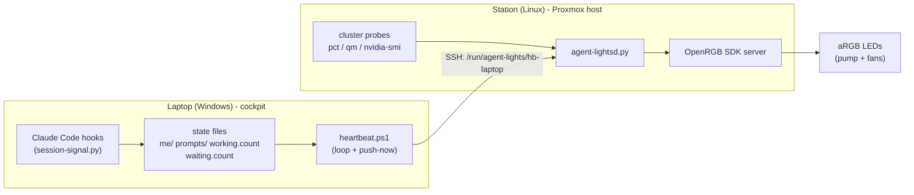

# Agent-Lights-Communication

[](LICENSE)
[](NOTICE)
[](#contributing)
[](#requirements)

**Ambient status for a fleet of AI-agent coding sessions - on the RGB LEDs your PC already has.**

Most "agent status light" projects want you to buy a gadget: a USB cube, a smart bulb, a
strip on the wall. Agent-Lights takes a different angle. If you run a homelab, you already
have a wall of addressable RGB - the pump ring and fans inside your desktop, driven by
[OpenRGB](https://openrgb.org/). Agent-Lights turns those LEDs into a single glanceable
display for how hard your agents are working, how many of them are running, and whether any
of them is stuck waiting for you.

It was built for a real setup: several Claude Code sessions running across a Proxmox host,
a couple of LXC containers, and a GPU VM, with a Windows laptop as the cockpit. But the
pieces are deliberately decoupled, so you can take just the light language, just the daemon,
or just the heartbeat.

## Why

When you orchestrate a fleet of coding agents, the thing you most want to know is not on any
screen you're currently looking at:

- Is anything actually running right now, or has it all gone quiet?
- How many sessions/subagents are working - one, or a swarm?
- Is one of them **blocked on a permission prompt** while you stare at a different window?
- Is the GPU pinned (a big local job) or idle?
- Did something fall over?

A notification is a poke; a dashboard is a tab you have to open. An ambient light in your
peripheral vision answers all of the above without stealing focus - and the LEDs are already
sitting there glowing a pointless static colour.

## Features

- **One glanceable light language** (full spec in [docs/SEMANTICS.md](docs/SEMANTICS.md)):
  blue = working, green = idle/backlog, amber = fault, rainbow = full send, plus a red
  "poke" for decisions waiting on you.
- **Counting by gentle dips, not blinking** - N smooth dips = N working units (or N pending
  decisions), countable at a glance, with a hard cap and a 6+ alarm.
- **Never-black transitions** - state changes go through a brightness channel or crossfade,
  so a black frame always means "something died", never "just switching".
- **Zone profiles** - map pump/fans to cluster units (host / GPU VM / containers) or to
  physical monitors, switchable at runtime with a hot-reload (no daemon restart).
- **GPU rainbow takeover** - sustained high GPU utilisation washes a rainbow across every
  zone.
- **Decoupled transport** - a laptop heartbeat pushes a tiny JSON blob over SSH; the daemon
  reads local files. No cloud, no account, no telemetry.
- **Fail-open everywhere** - every counter has a staleness gate and a fallback; a dead
  session cleans itself up.

## Architecture



The laptop counts sessions/subagents/prompts into small files and pushes a JSON heartbeat to
the station over SSH. The station daemon combines that heartbeat with its own probes (agent
processes in containers, GPU utilisation, a health log) and drives the LEDs through OpenRGB.
Either side degrades gracefully if the other is unavailable.

## Requirements

**Station (Linux):**
- [OpenRGB](https://openrgb.org/) with the SDK server running (default `127.0.0.1:6742`) and
  your RGB controller detected.
- Python 3.9+ and [`openrgb-python`](https://github.com/jath03/openrgb-python) in a venv.
- For the cluster/GPU features: a Proxmox host (`pct`, `qm`) and, optionally, an NVIDIA GPU
  in a VM (`nvidia-smi`). Without them the single-colour semaphore still works.

**Laptop (any OS with `ssh`; scripts are PowerShell for Windows):**
- OpenSSH client with a key-only login to the station.
- Optionally, [Claude Code](https://www.anthropic.com/claude-code) (or any agent runner) to
  drive the session counters via hooks. Any script that writes integers to the counter files
  works just as well.

### Reference setup (what this runs on in production)

Developed and running daily on:

- **Motherboard:** MSI Z790 with a 3-pin ARGB header (JRAINBOW) - any board OpenRGB can
  address per-LED will do.
- **LEDs:** a chain of ARGB case fans plus an ARGB pump block on one header
  (48 addressable LEDs total). Fan count and per-device LED counts are set in the config -
  nothing is hard-coded.
- **Station:** a small Proxmox box (Linux) that owns the LEDs; the laptop only pushes
  counter files over SSH, so the lights keep working even when the laptop sleeps.
- **GPU:** an NVIDIA card passed through to a VM, polled with `nvidia-smi` for the
  rainbow "full send" state - optional.

If your hardware differs, only the zone map / LED ranges in the config need calibrating
(see the calibration note below).

## ⚠️ Hardware safety

- This project only sends standard colour updates through the OpenRGB SDK (Direct mode).
  It never flashes firmware or writes persistent device settings.
- OpenRGB itself, however, talks directly to RGB controllers. Its documentation warns that
  on rare, specific devices this has caused problems - historically a few MSI boards had
  their RGB controller bricked, which is why OpenRGB disabled those devices outright. Check
  the [OpenRGB supported-devices list](https://openrgb.org/) for your motherboard **before**
  the first run.
- Start with the built-in override/test mode on a single zone, not full animations, to
  confirm your controller responds cleanly.
- Use at your own risk - see [LICENSE](LICENSE) (no warranty).

## Install

### 1. Station

```bash
# OpenRGB must already be running its SDK server (127.0.0.1:6742)
sudo mkdir -p /opt/agent-lights
python3 -m venv /opt/agent-lights/venv
/opt/agent-lights/venv/bin/pip install openrgb-python

sudo cp station/agent-lightsd.py         /usr/local/bin/
sudo cp station/agent-lights-profile.sh  /usr/local/bin/
sudo cp station/agent-lights-demo.sh     /usr/local/bin/
sudo cp config.example.conf              /etc/agent-lights.conf
sudo cp config.zones.example.conf        /etc/agent-lights-zones.conf   # optional (zone profiles)

sudo cp station/agent-lightsd.service /etc/systemd/system/
sudo systemctl daemon-reload
sudo systemctl enable --now agent-lightsd
```

Edit `/etc/agent-lights.conf` for your host (VMIDs, health log, colours). If you want zone
profiles, **calibrate the LED index ranges** in `/etc/agent-lights-zones.conf` for your
hardware (light one index at a time in OpenRGB to find which fan/pump each range covers).

Test the palette without any laptop: `sudo agent-lights-demo.sh`.

### 2. Laptop

```powershell
Copy-Item laptop\agent-lights-config.example.ps1 laptop\agent-lights-config.ps1
# edit agent-lights-config.ps1: SSH key path, station host, state dir
```

Run `laptop\push-now.ps1` once to confirm the heartbeat reaches the station (check
`/run/agent-lights/hb-laptop` on the station). Then register `laptop\heartbeat-loop.ps1` as a
Task Scheduler task at logon for a steady 15 s beat.

### 3. Agent hooks (optional)

To make the light follow your Claude Code sessions, wire `examples/session-signal.py` into
your `~/.claude/settings.json` using `examples/claude-hooks.example.json` as a template, and
point `AGENT_LIGHTS_STATE` at the same state directory the heartbeat reads.

## Configuration

Everything host-specific lives in two config files on the station
([`config.example.conf`](config.example.conf), [`config.zones.example.conf`](config.zones.example.conf))
and one on the laptop ([`agent-lights-config.example.ps1`](laptop/agent-lights-config.example.ps1)). Nothing
is hard-coded; there are no secrets in the repo (the SSH key lives on your machine, referenced
by path).

## How it compares

There is a small, fun ecosystem of "agent status light" projects. Agent-Lights sits in a
different spot: it drives the LEDs you already own and encodes **fleet** semantics (how many
units, which cluster node, decisions waiting) rather than a single on/off "is the agent
thinking" signal.

| Project | Hardware | Signal | Fleet-aware |
|---------|----------|--------|-------------|
| **Agent-Lights** | Your existing OpenRGB gear (pump/fans) | Working units, pending decisions, cluster/monitor zones, GPU load | Yes - counts sessions & subagents |
| vibecoding-signal-light | Dedicated USB/smart light | Agent busy / needs input | No |
| led-cube-agent-monitor | Dedicated LED cube | Per-agent activity | Partial |
| agent-light | Smart bulb | Busy / idle | No |
| vibesignal | Menu-bar / small light | Waiting-for-input alert | No |
| Emberglow | Dedicated ambient lamp | Thinking / done | No |

If you want a purpose-built desk gadget, those are great. If your homelab is already glowing
and you want it to *mean* something, that's Agent-Lights.

## Roadmap

- Replace the `openrgb-python` (GPL-3.0) client with a from-scratch OpenRGB SDK wire-protocol
  client over a raw socket, so the daemon can be pure MIT with no GPL dependency.
- Packaging: a proper Python package + `pip install` for the daemon.
- Cross-platform laptop agent (a small Python heartbeat to replace the PowerShell scripts).
- More transports (MQTT / local HTTP) alongside the SSH file push.
- Decision-panel integration - planned.
- Broader controller coverage beyond `device[0]`.

## See also

- **[agent-voice-communication](https://github.com/dawidsystemy/agent-voice-communication)** -
  the sibling project. It reads your agent's last message out loud (Piper TTS) so you can walk
  away from the screen entirely. Lights tell you *that* an agent needs you; voice tells you
  *what* it said.

If your rig just told you an agent needs your attention, consider starring the repo so other
people orchestrating fleets of agents can find it too.

## Contributing

Issues and pull requests are welcome - bug reports, new transports, controller coverage, or a
port of the laptop heartbeat to your OS. Keep the fail-open, no-secrets, no-telemetry
posture, and please don't bundle third-party binaries (see [NOTICE](NOTICE)).

## Credits

Built on the shoulders of [OpenRGB](https://openrgb.org/) and
[`openrgb-python`](https://github.com/jath03/openrgb-python). Some of the code in this repo was
written with the help of [Claude Code](https://www.anthropic.com/claude-code).

## Dependencies and licenses

This project's own code is MIT. It depends on third-party software that is **not** bundled here
and stays under its own license - see [NOTICE](NOTICE) for the full list. In short:

- **OpenRGB** (GPL-2.0) is reached as an external program over its TCP SDK socket (arm's-length),
  never linked or copied into this code. Install it yourself.
- **`openrgb-python`** (GPL-3.0) is imported by `station/agent-lightsd.py`. Because importing a
  GPL-3.0 library is an argument for linking, **the daemon module is effectively GPL-3.0-encumbered
  when used with this client**, even though the rest of the original code is offered under MIT. It
  is a declared dependency (not bundled). A future rewrite to a raw SDK-socket client would make
  the daemon pure MIT; see the roadmap and [NOTICE](NOTICE).

### Trademarks

OpenRGB, MSI, Mystic Light and JRAINBOW are trademarks of their respective owners and are used
here only descriptively, to state compatibility. **This project is not affiliated with or endorsed
by MSI, the OpenRGB project, or any other trademark holder.** No third-party logos are included.

## About the author

Built by Dawid Krętkowski - founder of SYSTEMY / AI SUIT (https://aisuit.pl), building an
autonomous AI-agent operating system for real businesses. This project is one visible piece of a
larger fleet-orchestration system we run in production.

## License

MIT - see [LICENSE](LICENSE) and [NOTICE](NOTICE).
